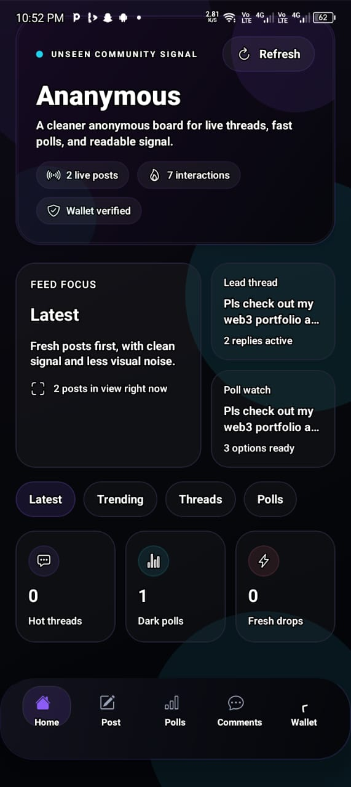

# Welcome to your Expo app 👋

# Anonymous Social App

Anonymous Social is a privacy-focused social networking app that lets users share thoughts, posts, and comments without revealing their identity. Built with React Native and Expo, it supports both Expo Go for rapid development and native Android builds for production releases.

## Features

- Post anonymously to a public feed
- Comment and vote on posts
- Real-time notifications
- Trending topics and posts
- Secure backend with Node.js and Express

## Screenshots

<!-- Replace the image links below with your own screenshots -->
<p align="center">
  
</p>

## Getting Started

### Run with Expo Go (Recommended for Development)

1. Install dependencies:
   ```bash
   npm install
   ```
2. Start the Expo server:
   ```bash
   npx expo start
   ```
3. Scan the QR code with the Expo Go app on your device.

### Build Native Android APK

1. Navigate to the `android` folder:
   ```bash
   cd android
   ```
2. Build the release APK:
   ```bash
   gradlew.bat assembleRelease
   ```
3. Find the APK in `android/app/build/outputs/apk/release/`.

## Backend

The backend is located in the `anonymous-app-backend` folder. It uses Node.js, Express, and a SQL database. See the backend README for setup instructions.

## Live Admin Dashboard

The standalone admin dashboard can be deployed as a separate web service with `npm run admin:web`. When it is pointed at the same backend as the mobile app, deleting or moderating a post in the dashboard updates the app feed immediately because both read from the same database.

## Contributing

Pull requests are welcome! For major changes, please open an issue first to discuss what you would like to change.

## License

MIT
This is an [Expo](https://expo.dev) project created with [`create-expo-app`](https://www.npmjs.com/package/create-expo-app).

## Get started

1. Install dependencies

   ```bash
   npm install
   ```

2. Start the app

   ```bash
   npx expo start
   ```

In the output, you'll find options to open the app in a

- [development build](https://docs.expo.dev/develop/development-builds/introduction/)
- [Android emulator](https://docs.expo.dev/workflow/android-studio-emulator/)
- [iOS simulator](https://docs.expo.dev/workflow/ios-simulator/)
- [Expo Go](https://expo.dev/go), a limited sandbox for trying out app development with Expo

You can start developing by editing the files inside the **app** directory. This project uses [file-based routing](https://docs.expo.dev/router/introduction).

## Get a fresh project

When you're ready, run:

```bash
npm run reset-project
```

This command will move the starter code to the **app-example** directory and create a blank **app** directory where you can start developing.

## Learn more

To learn more about developing your project with Expo, look at the following resources:

- [Expo documentation](https://docs.expo.dev/): Learn fundamentals, or go into advanced topics with our [guides](https://docs.expo.dev/guides).
- [Learn Expo tutorial](https://docs.expo.dev/tutorial/introduction/): Follow a step-by-step tutorial where you'll create a project that runs on Android, iOS, and the web.

## Join the community

Join our community of developers creating universal apps.

- [Expo on GitHub](https://github.com/expo/expo): View our open source platform and contribute.
- [Discord community](https://chat.expo.dev): Chat with Expo users and ask questions.
