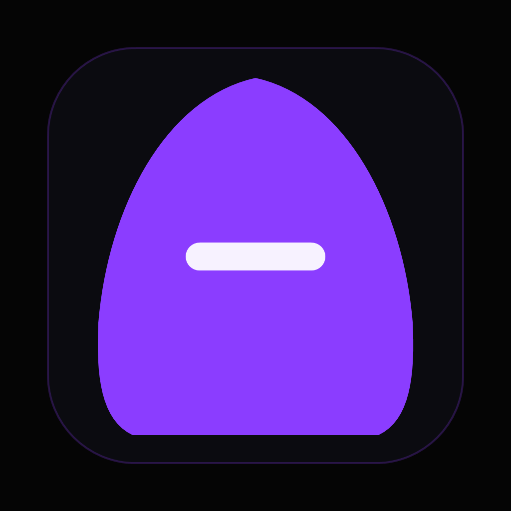
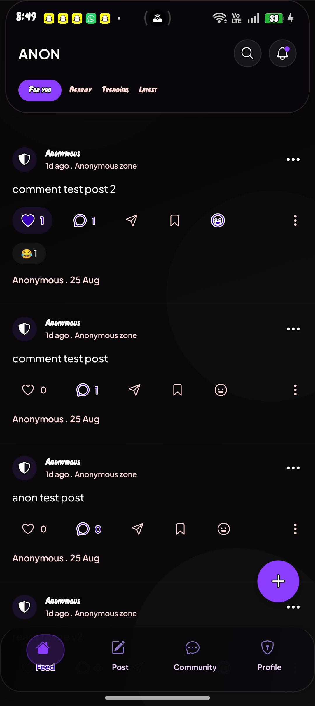
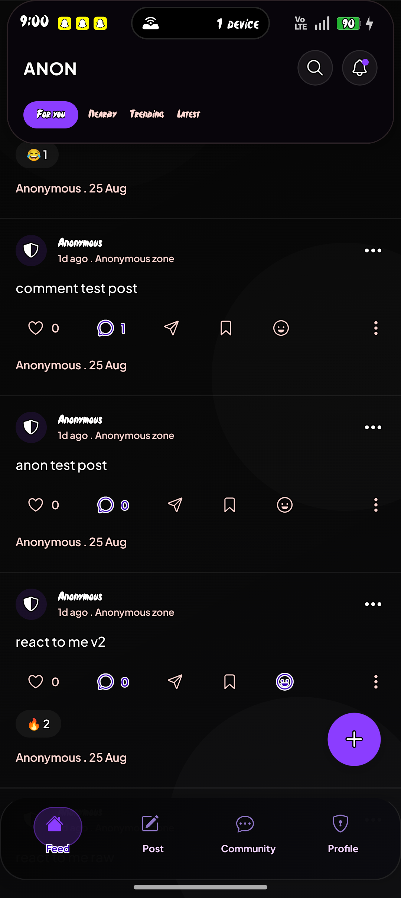
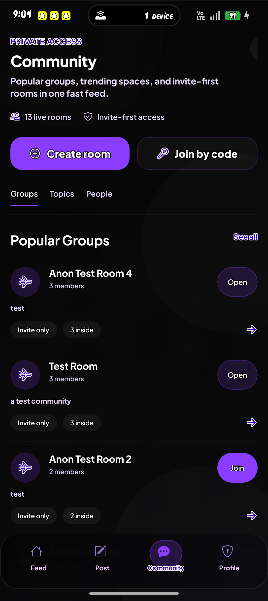

<p align="center">
  
</p>

<h1 align="center">ANON</h1>
<p align="center"><b>Private by default.</b> Speak freely, stay anonymous.</p>

## What this is

Most "anonymous message" apps make you copy a link, paste it somewhere, and manually collect replies. ANON skips all of that: people join a shared space (the public feed, or a private invite-only community) and post, comment, vote, and react without anyone — including other members — ever seeing who they are. The server itself never sends another user's name to the app, so there's nothing to reverse-engineer even by inspecting network traffic.

## Features

- **Anonymous posting** — text, images, polls, and 24-hour disappearing posts, with nobody's identity attached
- **Communities** — invite-only rooms with an auto-generated join code; the creator becomes admin, admins can approve/remove members and moderate messages
- **Reactions** — emoji reactions on posts (tap the smiley or long-press a post), plus upvote/downvote
- **Comments** — threaded replies on any post
- **Live feed** — new posts appear via a real-time banner (Socket.IO), no need to pull-to-refresh
- **Search** — full backend search across the feed, not just what's currently loaded
- **Notifications** — in-app and push notifications for comments, votes, community messages, moderation actions, and more
- **Account security** — email/password auth, forgot-password (emailed reset code), email verification, change password
- **Saved posts** — bookmark posts locally to find them again later
- **Admin dashboard** — a separate web panel for moderation, reading from the same database as the app

## Tech stack

- **App**: React Native + Expo (SDK 54), TypeScript, React Navigation, Socket.IO client
- **Backend**: Node.js + Express, PostgreSQL, Socket.IO, JWT auth
- **Builds**: EAS Build for installable Android APKs (the app uses native modules — wallet connect, gesture handling — so it won't run in Expo Go; you need a development build or an EAS build)
- **Email**: Resend (for password reset / verification codes)

## Screenshots

<!-- Add real screenshots here, e.g.: -->
<!-- <p align="center">
  
  
  
</p> -->

## Project structure

```
.
├── App.js                     # App entry point, providers, error boundary
├── src/
│   ├── screens/                # Home, Discover, Post composer, Communities, Profile, Auth
│   ├── contexts/                # Wallet/auth context, Toast context
│   ├── components/              # Shared UI (HeroHeading, Skeleton, Toast, ...)
│   ├── services/                # API client
│   └── utils/                   # Haptics, saved posts, error messages, ...
├── anonymous-app-backend/
│   ├── controllers/              # Route handlers
│   ├── models/                   # Database queries
│   ├── routes/                   # Express routers
│   ├── services/                 # Notifications, push, email, trending
│   └── database/schema.sql       # Full Postgres schema
└── src/admin/AdminDashboard.tsx  # Standalone moderation web panel
```

## Getting started

### 1. Backend

```bash
cd anonymous-app-backend
npm install
cp .env.example .env   # fill in DATABASE_URL, JWT_SECRET, etc.
npm run db:migrate     # applies database/schema.sql
npm run dev            # starts the API on http://localhost:4000
```

### 2. App

```bash
npm install
cp .env.example .env   # point EXPO_PUBLIC_API_BASE_URL at your backend
```

Because of native dependencies, run one of:

```bash
npx expo run:android        # build + install locally (needs Android Studio/adb)
eas build --platform android --profile preview   # cloud build, produces an installable APK
```

### 3. Admin dashboard (optional)

```bash
npm run admin:web
```

Point it at the same backend as the app — moderating a post there updates the live app feed immediately.

## Contributing

Pull requests are welcome. For larger changes, open an issue first to discuss what you'd like to change.

## License

MIT
