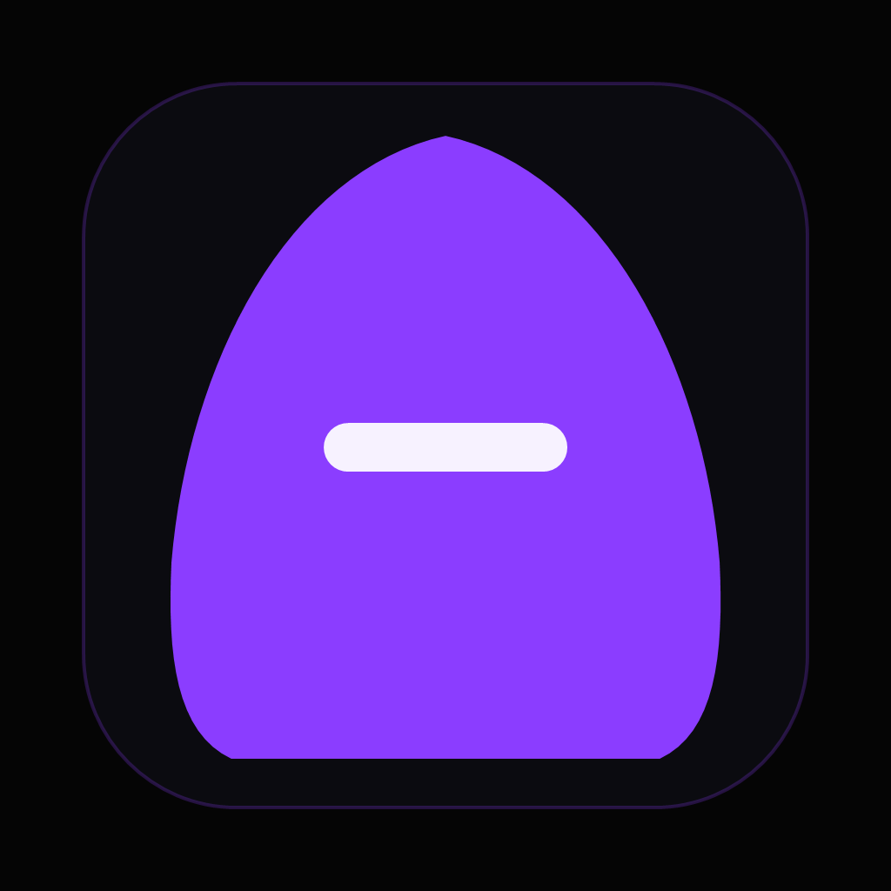
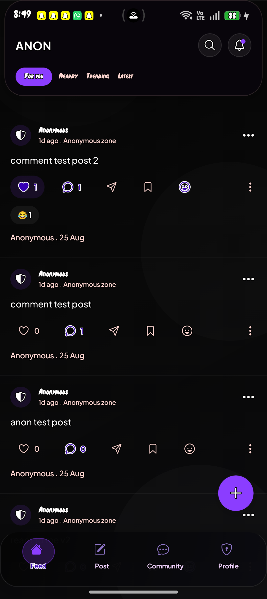
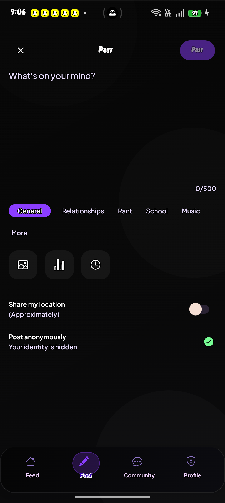
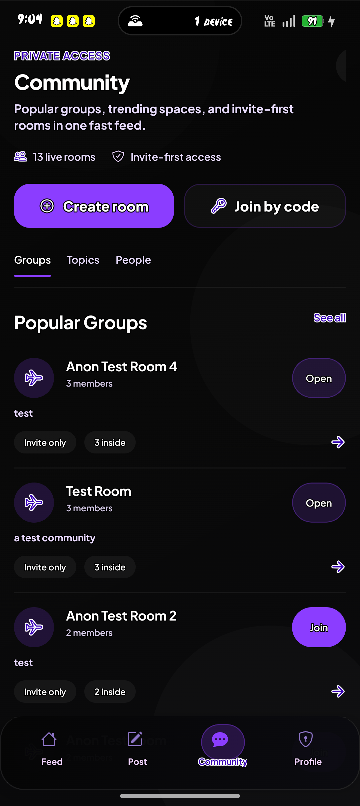
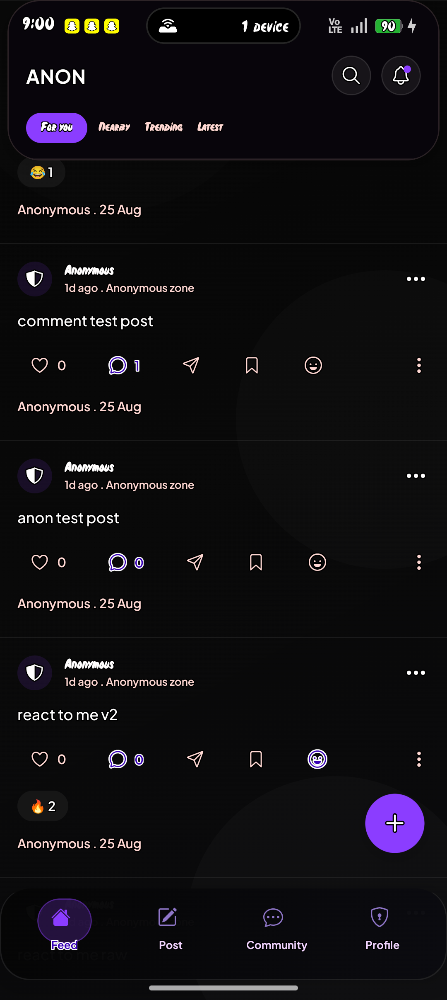

<p align="center">
  
</p>

<h1 align="center">ANON</h1>

<p align="center">
  <strong>Private by default.</strong><br />
  An anonymous social platform where people post, discuss, and react without ever revealing who they are.
</p>

<p align="center">
  
  
  
  
  
  
</p>

<p align="center">
  <a href="#overview">Overview</a> ·
  <a href="#features">Features</a> ·
  <a href="#engineering-highlights">Engineering</a> ·
  <a href="#tech-stack">Tech Stack</a> ·
  <a href="#architecture">Architecture</a> ·
  <a href="#getting-started">Getting Started</a>
</p>

<br />

<p align="center">
  
  &nbsp;
  
  &nbsp;
  
  &nbsp;
  
</p>
<p align="center"><sub><b>Home Feed</b> &nbsp;·&nbsp; <b>Create Post</b> &nbsp;·&nbsp; <b>Communities</b> &nbsp;·&nbsp; <b>Profile</b></sub></p>

---

## Overview

Most anonymous-message apps make users share a link and collect replies by hand. **ANON** replaces that with a real social space: a public feed and private, invite-only communities where people can post, comment, vote, and react while staying fully anonymous.

Anonymity is enforced **on the server**, not just hidden in the interface. The API never sends another user's identity to the client, so it can't be recovered even by inspecting network traffic.

## Features

| Feature | Description |
|:---|:---|
| **Anonymous Posting** | Text, images, polls, and 24-hour disappearing posts, with no identity attached |
| **Private Communities** | Invite-only rooms with generated join codes, admin roles, member approval, and moderation |
| **Real-Time Feed** | New posts appear instantly over WebSockets, with no manual refresh |
| **Reactions & Voting** | Emoji reactions (tap or long-press) plus upvote and downvote |
| **Threaded Comments** | Focused discussions on any post |
| **Search** | Server-side search across the entire feed |
| **Notifications** | In-app and push alerts for replies, votes, community activity, and moderation |
| **Account Security** | Email and password sign-in, email verification, and password reset by emailed code |
| **Saved Posts** | Bookmark posts to revisit later |
| **Admin Dashboard** | A web moderation panel whose actions show in the live app immediately |

## Engineering Highlights

- **Server-side anonymity:** responses are stripped of other users' identities before they leave the API, so privacy doesn't depend on the client.
- **Real-time updates:** a Socket.IO layer pushes new posts, reactions, and community messages to connected clients as they happen.
- **Security hardening:** passwords are hashed with scrypt, sessions use JWTs, and the API uses Helmet security headers and per-route rate limiting.
- **Smooth mobile UX:** infinite-scroll pagination, skeleton loaders, haptic feedback, and swipe navigation between tabs.
- **Production deployment:** the API and admin dashboard are defined as infrastructure-as-code on Render, and Android builds ship through EAS Build.

## Tech Stack

| Layer | Technologies |
|:---|:---|
| **Mobile** | React Native, Expo SDK 54, TypeScript, React Navigation, Expo Notifications |
| **Backend** | Node.js, Express, Socket.IO, JWT, Helmet, express-rate-limit |
| **Database** | PostgreSQL |
| **Services** | Cloudinary (media), Resend (email), Expo Push (notifications) |
| **DevOps** | Render (hosting), EAS Build (Android releases) |

## Architecture

```
┌────────────────────┐      REST + WebSocket      ┌────────────────────────┐       ┌──────────────┐
│   Mobile App       │ ─────────────────────────▶ │   Express API          │ ────▶ │  PostgreSQL  │
│   (React Native)   │ ◀───────────────────────── │   + Socket.IO Server   │       └──────────────┘
└────────────────────┘     anonymized payloads    └────────────────────────┘
                                                      ▲          │
┌────────────────────┐                                │          ├────▶  Cloudinary  (media)
│   Admin Dashboard  │ ───────────────────────────────┘          ├────▶  Resend      (email)
│   (Web)            │                                           └────▶  Expo Push   (notifications)
└────────────────────┘
```

## Project Structure

```
.
├── App.js                         # Entry point, providers, error boundary
├── src/
│   ├── screens/                   # Home, Discover, Composer, Communities, Profile, Auth
│   ├── components/                # Shared UI components
│   ├── contexts/                  # Auth and toast state
│   ├── services/                  # API client
│   ├── utils/                     # Haptics, saved posts, error handling
│   └── admin/                     # Moderation dashboard
└── anonymous-app-backend/
    ├── controllers/               # Route handlers
    ├── middleware/                # Auth and rate limiting
    ├── models/                    # Data access layer
    ├── routes/                    # Express routers
    ├── services/                  # Notifications, push, email, trending
    └── database/schema.sql        # PostgreSQL schema
```

## Getting Started

> **Prerequisites:** Node.js 20+, PostgreSQL, and Android Studio (or an [Expo EAS](https://expo.dev/eas) account for cloud builds).

**1. Backend**

```bash
cd anonymous-app-backend
npm install
cp .env.example .env        # configure DATABASE_URL, JWT_SECRET, Cloudinary and Resend keys
npm run db:migrate          # apply the database schema
npm run dev                 # start the API on http://localhost:4000
```

**2. Mobile app**

Create a `.env` file in the project root:

```env
EXPO_PUBLIC_API_BASE_URL=http://<your-local-ip>:4000
```

The app uses native modules, so it needs a development build (Expo Go is not supported):

```bash
npm install
npx expo run:android                                # local build to a device or emulator
eas build --platform android --profile preview      # cloud build that produces an installable APK
```

**3. Admin dashboard** *(optional)*

```bash
npm run admin:web
```

## Author

**Jeph**: designer and developer of the mobile app, backend API, database, real-time layer, and admin tooling.

[](https://github.com/jephcoded)

## License

Copyright © 2026 Jeph. **All rights reserved.**

This repository is public for portfolio purposes only. No part of this code may be copied, modified, distributed, or used without prior written permission from the author. See [LICENSE](LICENSE) for details.
